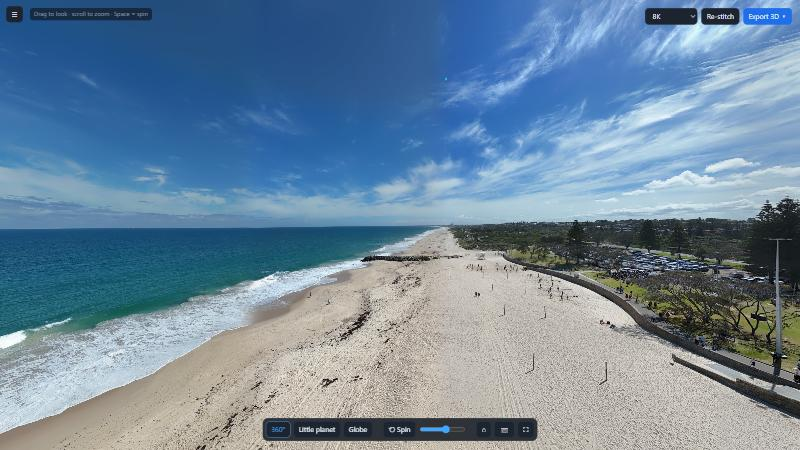
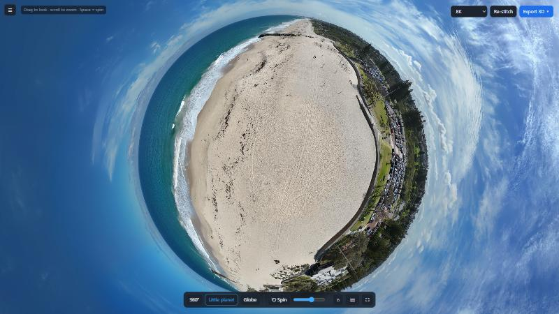
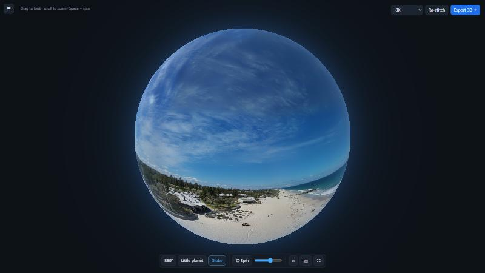
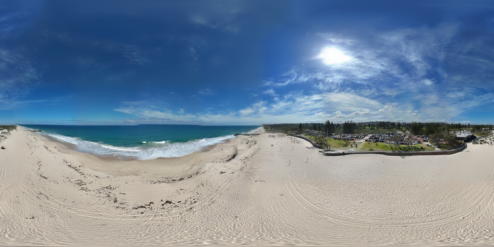

# 3D Pano Viewer

Turns DJI sphere-panorama shots into a 360° view you can spin, and exports it as 3D models for Blender.



| Little planet | Globe |
|---|---|
|  |  |

**Stitched output**: 35 DJI Mini 4 Pro shots merged into one equirectangular image, which is also exported for use as a Blender world/HDRI:



## Use
1. Copy a panorama folder from the drone (`DCIM/PANORAMA/001_xxxx`), or its `.zip`, into `Panoramas/`, or click **Change…** in the sidebar to use any folder. Press ☰ or Tab to hide the sidebar.
2. Run **3D Pano Viewer.exe** and pick the panorama, then click **Stitch panorama** (takes about 1–2 minutes at 8K).
3. View it in **360°**, **Little planet**, or **Globe** mode. Drag to look around and scroll to zoom. Space turns spin on/off, F goes fullscreen, and 1/2/3 switch modes.
4. Click **Export 3D** to write files to `Exports/<name>/`: a `.glb`, an `.obj` with its `.mtl` and texture, and an equirectangular `.jpg`.

## Rebuild the exe
```
python make_icon.py
python -m PyInstaller --noconfirm --onefile --windowed --name "3D Pano Viewer" --icon icon.ico --add-data "web;web" --add-data "icon.ico;." app.py
```
Source: `stitcher.py` (alignment + blending), `exporter.py` (GLB/OBJ), `app.py` (local server + window), `web/index.html` (WebGL viewer).

## Download
Grab **3D Pano Viewer.exe** from the [Releases](../../releases) page, put it in an empty folder and run it. It creates `Panoramas/`, `Exports/` and `Cache/` next to itself.

Running from source needs Python 3 with `opencv-python numpy scipy pillow`, then `python app.py`. Microsoft Edge is used for the app window.
